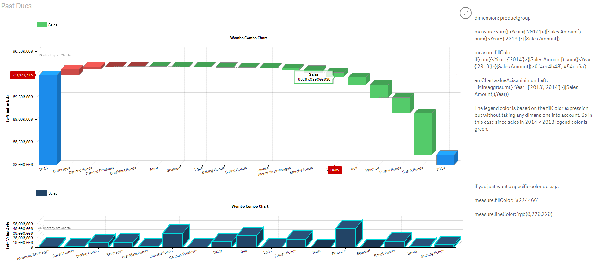
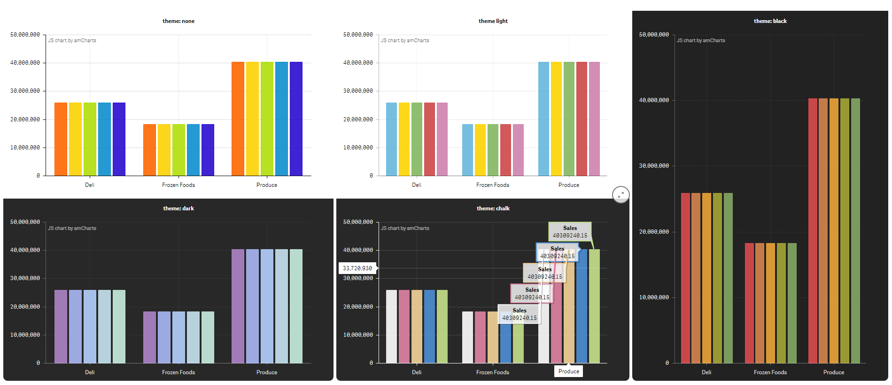

# Qliksense Extension integrating amCharts.

## Introduction
This is a work in progress project for integrating [amCharts](https://www.amcharts.com/) charting library into qliksense extension(s).

At the moment this project is an implementation of a combo chart that includes a waterfall type measure.

The goal of the combo chart is to give the user alooot of settings to mess around with, the screenshot examples below are just a small subset of outcomes you can produce. It is definatly possible to make visualizations that don't make sense or don't follow best practices or similar. I think the standard QlikSense charts are really good at helping the user make charts that make sense and follow best practices, but that sometimes removes alot of flexibility. When developing this extension I will to a greater degree choose flexibility even when it means giving the users settings that potentially can make graphs that don't make sense.

Please rate & give feedback! If you wan't to contribute feel free to message me on github.

### Current Development
Below are the current changes I'm looking into.
* Making sure that the standard QlikSense number formatting is represented on the waterfall charts start and end labels as well as the value axes.
* Implementing multi-dimensionality (postponed)

### Latest 5 Changes
* Made the calculated colors now appear on legends as a calculation disregarding the chart dimensions. (Think how the color calculations would calculate on a total row). Added a calculation field to calculate the minimum value for the left and right axis. Added a screenshot to explain usage of the the mentioned changes.
* The line & fill colors on the measures are now entered via expression and applied on each dimension/x-axis value. Which means that you can color stuff based on your data e.g. if(sum(x)>sum(y), 'rgb(0,220,0)', 'rgb(220,0,0)'). Another usefull way that I usually use this for is when you have a dimensional heirarchy that is the 'center-piece' of your application, then you can load in RGB/Hex values that correspond to that heirarchy e.g. ProductGroup=FX,Hex=#123123. And then color your data consistently based on that. However for that to be more usefull I have to look into implementing multidimensionality in the amCombo chart.
* Added theme's setting in the amChart settings. If you make any setting that conflicts with the theme it will choose your setting. E.g. choosing to change color of a measure. See screenshots below of the themes.
* Drill down dimensions works now. If you have a drill heirarchy dim1>dim2>dim3 and you select 1 value in dim1 then dim2 will be the category split.
* When you select an area (zoom) or click a value in the chart, instead of zooming through the amCharts API the dimension values are instead selected in the QlikSense application, so that it works similar to other QlikSense objects. (shared zooming/selection between objects).

## Screenshots
### Calculated colors and calculated minimum axis values

### amChart themes.

### New method for creating waterfall's in the combo chart.

### Combo chart (waterfall measure type)

### Random settings screens.

### Combo chart (silly visualizations)

### Combo Chart (New measure Opacity)

### Combo Chart (New stacking settings)

## How to use
Import amCombo.zip into your qliksense dev-hub extensions folder.

## Documentation
When using the amCombo chart the naming and structure follows that of the amCharts API.
* The additional properties on the measures are a subset of the API properties [amGraph](https://docs.amcharts.com/3/javascriptcharts/AmGraph).
* The properties in the amCharts section are a subset of the API properties of the [amSerialChart](https://docs.amcharts.com/3/javascriptcharts/AmSerialChart) and its descendant objects (valueAxes, legend, titles & categoryAxis).

## Disclaimer
I'm in no way affiliated with amcharts.com. Their library is free to use for commercial purposes with the caveate that you must include the link to their website in the charts (as seen on the top left of the chart screenshots). If you would want a version without links to amcharts.com they would have to implement a solution to market.qlik.